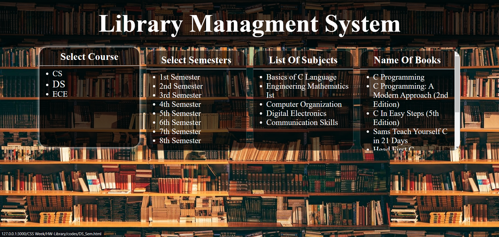

# ONLINE LIBRARY SYSTEM
This is my one of the starting saimple project in my Web Devlopment Journey.That I publish here.


## Preview



## Folder Hierarchy

```bash
Online Library Sysytem
•
|
|-- index.html
|
|-- codes
|   |-- course.html
|   |-- CS_Sem.html
|   |-- DS_Sem.html
|   |-- ECE_Sem.html
|   |
|   |-- CS_Sem1.html
|   |-- CS_Sem2.html
|   |-- CS_Sem3.html
|   |-- ...
|   |-- DS_Sem1.html
|   |-- DS_Sem2.html
|   |-- DS_Sem3.html
|   |-- ...
|   |-- ECE_Sem1.html
|   |-- ECE_Sem2.html
|   |-- ECE_Sem3.html
|   |-- ...
|
|-- Style
|   |-- main_style.css
|   |-- codes_style.css
|   |-- ...
|
|-- IMAGES
|   |-- c_icon.png
|   |-- screenshot.png
|   |-- ...
|   |-- ...
|
|-- README.md
```